# Heart Disease Risk Prediction Using Machine Learning

## Overview

This project develops an end-to-end **Machine Learning classification system for heart disease prediction** using patient clinical and health-related attributes.

The project follows a complete machine learning workflow:

**Data Exploration → Data Cleaning → Preprocessing → Model Training → Model Evaluation → Model Comparison → Feature Importance → Final Dashboard**

Six classification models were trained and evaluated, followed by a **Weighted Voting Ensemble** that combines the predictions of Gradient Boosting, Extra Trees, and K-Nearest Neighbors.

> **Medical Disclaimer:** This project is intended for educational and research purposes only. It is not a medical diagnostic system and should not be used as a substitute for professional medical advice.

---

## Key Highlights

- 918 patient records
- 11 original input features
- Categorical feature encoding using One-Hot Encoding
- Numerical feature standardization using `StandardScaler`
- Stratified 80/20 train-test split
- Six trained classification models
- Weighted Soft Voting Ensemble
- Accuracy, Precision, Recall, F1 Score, and ROC-AUC evaluation
- Confusion matrices and ROC curves
- Random Forest and Gradient Boosting feature importance
- Logistic Regression coefficient analysis
- Final performance dashboard
- Saved trained models in `.pkl` format
- Reproducible Python environment using `requirements.txt`

---

## Project Objective

The objective of this project is to build and compare machine learning models that classify patients into two target classes:

| Target | Meaning |
|---:|---|
| `0` | No Heart Disease |
| `1` | Heart Disease |

The project focuses on building a reliable machine learning workflow and understanding model performance and feature relationships within the supplied dataset.

---

## Dataset

The project uses `heart.csv` containing **918 records and 12 columns**.

### Features

| Feature | Type | Description |
|---|---|---|
| `Age` | Numerical | Age of the patient |
| `Sex` | Categorical | Sex of the patient |
| `ChestPainType` | Categorical | Type of chest pain |
| `RestingBP` | Numerical | Resting blood pressure |
| `Cholesterol` | Numerical | Cholesterol level |
| `FastingBS` | Numerical | Fasting blood sugar indicator |
| `RestingECG` | Categorical | Resting ECG result |
| `MaxHR` | Numerical | Maximum heart rate achieved |
| `ExerciseAngina` | Categorical | Exercise-induced angina |
| `Oldpeak` | Numerical | ST depression |
| `ST_Slope` | Categorical | Slope of the peak exercise ST segment |
| `HeartDisease` | Target | Target classification |

---

# Machine Learning Workflow

```text
                        ┌──────────────────┐
                        │    heart.csv     │
                        │   918 Records    │
                        └────────┬─────────┘
                                 │
                                 ▼
                     ┌──────────────────────┐
                     │ Exploratory Analysis │
                     │       (EDA)          │
                     └──────────┬───────────┘
                                │
                                ▼
                     ┌──────────────────────┐
                     │    Data Cleaning     │
                     │ Invalid Values /     │
                     │ Duplicate Checking   │
                     └──────────┬───────────┘
                                │
                                ▼
                     ┌──────────────────────┐
                     │ Feature Preprocessing│
                     │ One-Hot Encoding     │
                     │ Standard Scaling     │
                     └──────────┬───────────┘
                                │
                                ▼
                     ┌──────────────────────┐
                     │  Train / Test Split  │
                     │      80% / 20%       │
                     └──────────┬───────────┘
                                │
            ┌───────────────────┼───────────────────┐
            │                   │                   │
            ▼                   ▼                   ▼
       Logistic            Random Forest      Gradient Boosting
       Regression
            │                   │                   │
            └───────────────────┼───────────────────┘
                                │
                    ┌───────────┴───────────┐
                    │                       │
                    ▼                       ▼
               Extra Trees                KNN
                    │                       │
                    └───────────┬───────────┘
                                │
                                ▼
                     ┌──────────────────────┐
                     │ Weighted Voting      │
                     │     Ensemble         │
                     └──────────┬───────────┘
                                │
                                ▼
                     ┌──────────────────────┐
                     │ Model Evaluation     │
                     │ Accuracy / Precision │
                     │ Recall / F1 / AUC    │
                     └──────────┬───────────┘
                                │
                                ▼
                     ┌──────────────────────┐
                     │ Feature Importance   │
                     │ & Interpretation     │
                     └──────────┬───────────┘
                                │
                                ▼
                     ┌──────────────────────┐
                     │   Final Dashboard    │
                     └──────────────────────┘
```

---

# 1. Exploratory Data Analysis

The EDA stage is used to understand the structure, distribution, relationships, and possible outliers in the dataset before model training.

The project generates:

- Target distribution
- Age distribution by heart disease class
- Correlation heatmap
- Numerical feature box plots
- Heart disease distribution by sex

## Target Distribution

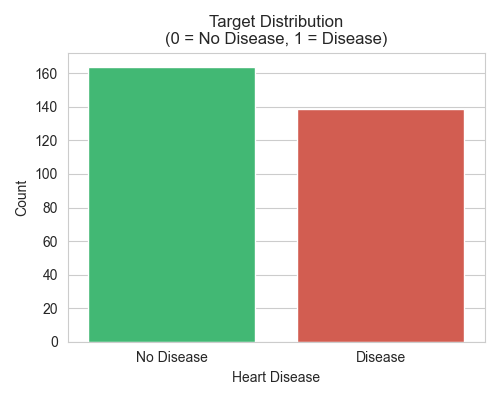

## Age Distribution

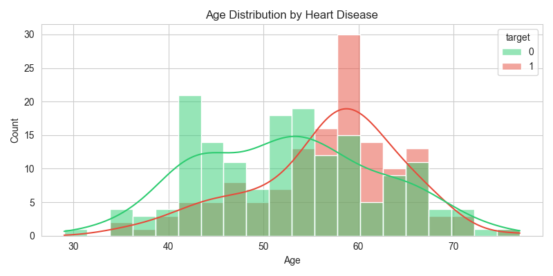

## Correlation Heatmap

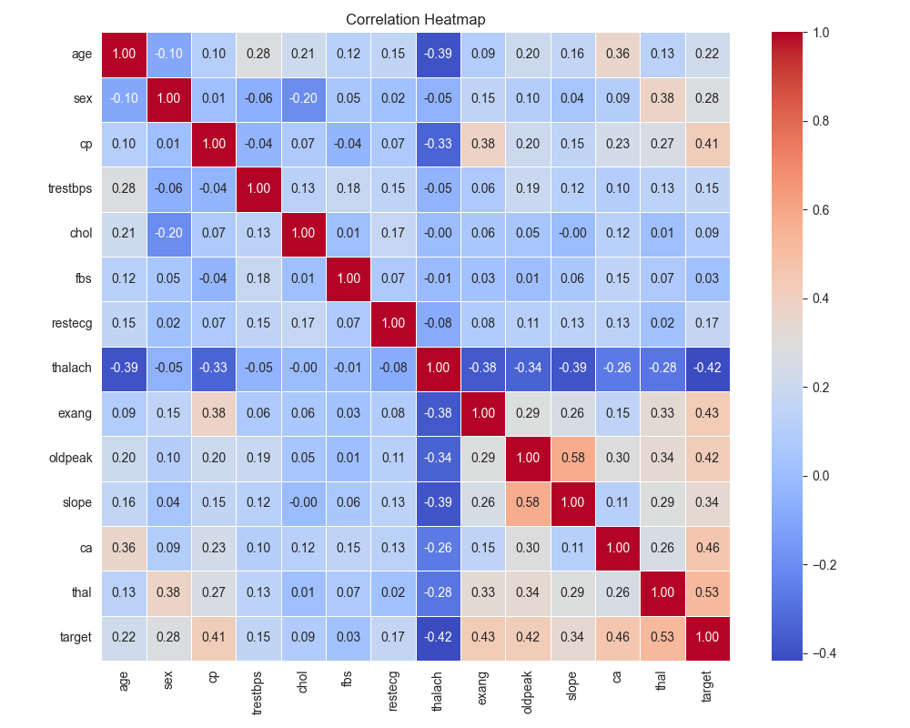

## Numerical Feature Analysis

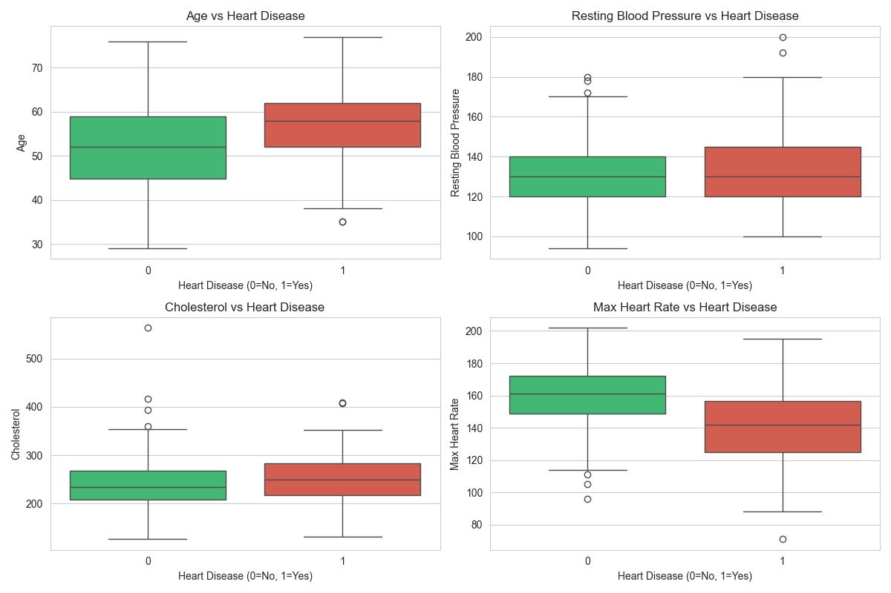

## Heart Disease by Sex

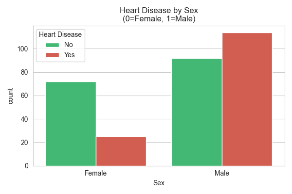

---

# 2. Data Cleaning

The cleaning stage checks the dataset for missing values, invalid values, and duplicate records.

### Cholesterol

Values where:

```text
Cholesterol = 0
```

are treated as invalid and replaced with the median cholesterol value calculated from valid observations.

### Resting Blood Pressure

Values where:

```text
RestingBP = 0
```

are treated as invalid and replaced with the median of valid observations.

### Duplicate Records

Duplicate records are checked and removed when present.

The cleaned dataset is saved as:

```text
data/heart_cleaned.csv
```

---

# 3. Feature Preprocessing

The target variable is separated from the input features:

```python
X = df.drop("HeartDisease", axis=1)
y = df["HeartDisease"]
```

### Categorical Features

One-hot encoding is applied to:

```text
Sex
ChestPainType
RestingECG
ExerciseAngina
ST_Slope
```

### Numerical Features

Standardization using `StandardScaler` is applied to:

```text
Age
RestingBP
Cholesterol
FastingBS
MaxHR
Oldpeak
```

### Train-Test Split

The processed data is split using:

```text
Training Data : 80%
Testing Data  : 20%
Random State  : 42
Stratification : Enabled
```

The preprocessing artifacts are saved for reuse:

```text
data/X_train.csv
data/X_test.csv
data/y_train.csv
data/y_test.csv
models/scaler.pkl
```

---

# 4. Machine Learning Models

The project trains and compares six classification approaches.

## Logistic Regression

Used as the baseline model.

```python
LogisticRegression(
    max_iter=1000,
    random_state=42,
    C=1.0
)
```

Saved as:

```text
models/logistic_regression.pkl
```

## Random Forest

A tuned tree-based ensemble model.

```python
RandomForestClassifier(
    n_estimators=100,
    max_depth=10,
    min_samples_leaf=4,
    min_samples_split=2,
    random_state=42,
    n_jobs=-1
)
```

Saved as:

```text
models/random_forest.pkl
```

## Gradient Boosting

A sequential boosting model configured with:

```python
GradientBoostingClassifier(
    n_estimators=150,
    learning_rate=0.05,
    max_depth=3,
    subsample=0.8,
    random_state=42
)
```

Saved as:

```text
models/gradient_boosting.pkl
```

## Extra Trees

An extremely randomized tree ensemble.

```python
ExtraTreesClassifier(
    n_estimators=100,
    max_depth=8,
    random_state=42,
    n_jobs=-1
)
```

Saved as:

```text
models/extra_trees.pkl
```

## K-Nearest Neighbors

Distance-weighted KNN:

```python
KNeighborsClassifier(
    n_neighbors=19,
    weights="distance"
)
```

Saved as:

```text
models/knn.pkl
```

---

# 5. Weighted Voting Ensemble

The final ensemble combines:

- Gradient Boosting
- Extra Trees
- K-Nearest Neighbors

using **soft voting**.

### Weights

```text
Gradient Boosting → 1
Extra Trees       → 1
KNN               → 2
```

Configuration:

```python
VotingClassifier(
    estimators=[
        ("gb", gb),
        ("et", et),
        ("knn", knn)
    ],
    voting="soft",
    weights=[1, 1, 2]
)
```

Saved as:

```text
models/voting_ensemble.pkl
```

The ensemble is the strongest model in the supplied `results.csv` across the reported evaluation metrics.

---

# 6. Model Performance

The following results are taken from the project's generated `models/results.csv`.

| Model | Accuracy | Precision | Recall | F1 Score | ROC-AUC |
|---|---:|---:|---:|---:|---:|
| Logistic Regression | 88.59% | 88.57% | 91.18% | 89.86% | 0.9332 |
| Random Forest | 87.50% | 86.92% | 91.18% | 89.00% | 0.9246 |
| Gradient Boosting | 87.50% | 89.11% | 88.24% | 88.67% | 0.9299 |
| Extra Trees | 86.41% | 85.32% | 91.18% | 88.15% | 0.9243 |
| KNN | 89.13% | 88.68% | 92.16% | 90.38% | 0.9346 |
| **Voting Ensemble** | **91.85%** | **91.43%** | **94.12%** | **92.75%** | **0.9394** |

## Best Model

### 🏆 Weighted Voting Ensemble

The Weighted Voting Ensemble achieved:

- **Accuracy:** 91.85%
- **Precision:** 91.43%
- **Recall:** 94.12%
- **F1 Score:** 92.75%
- **ROC-AUC:** 0.9394

Based on the supplied results, it is the best-performing model in this experiment.

---

# 7. Model Evaluation Visualizations

## Logistic Regression — Confusion Matrix

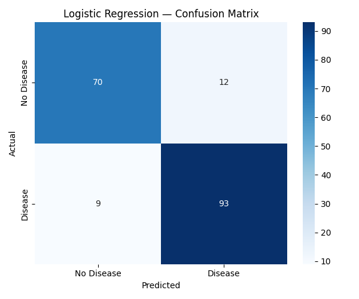

## Logistic Regression — ROC Curve

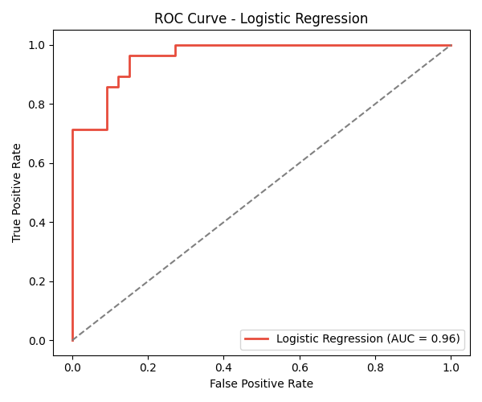

## Random Forest — Confusion Matrix

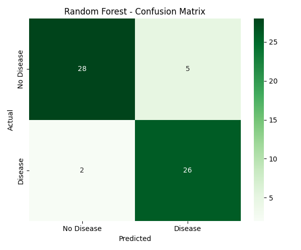

## Gradient Boosting — Confusion Matrix

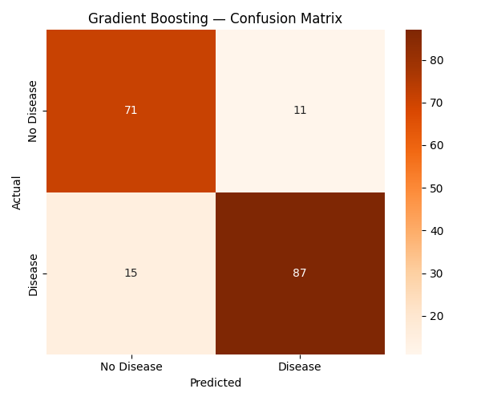

## ROC Comparison

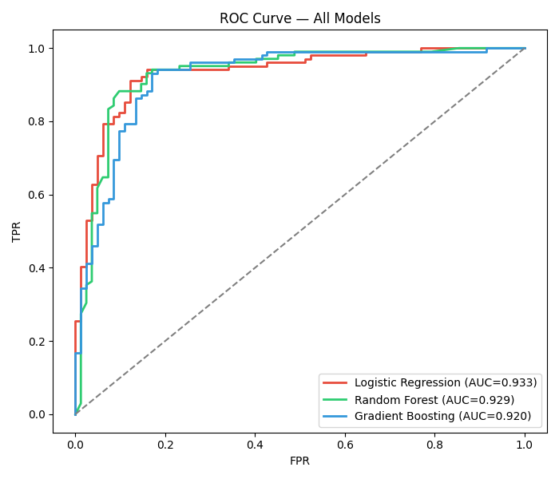

---

# 8. Feature Importance and Model Interpretation

The project includes model interpretation to understand which processed features contribute most strongly to the predictions.

### Random Forest Feature Importance

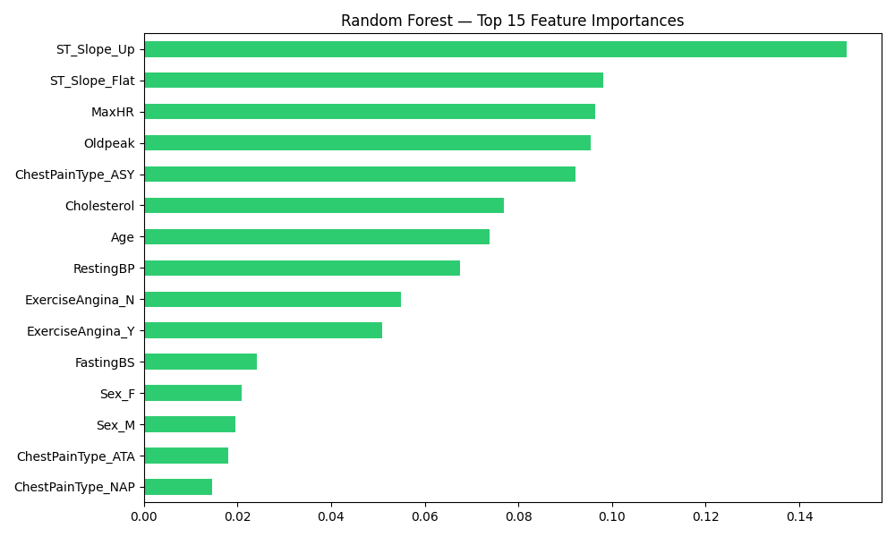

### Gradient Boosting Feature Importance

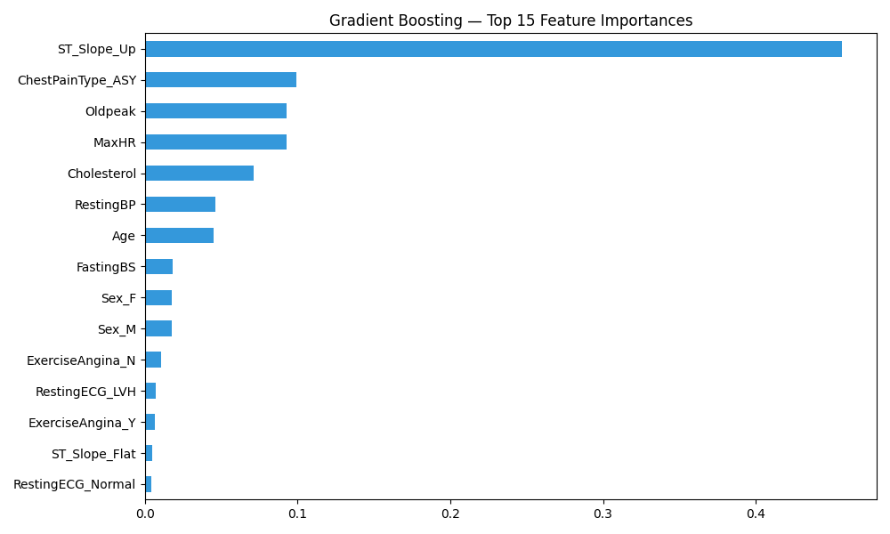

### Logistic Regression Coefficients

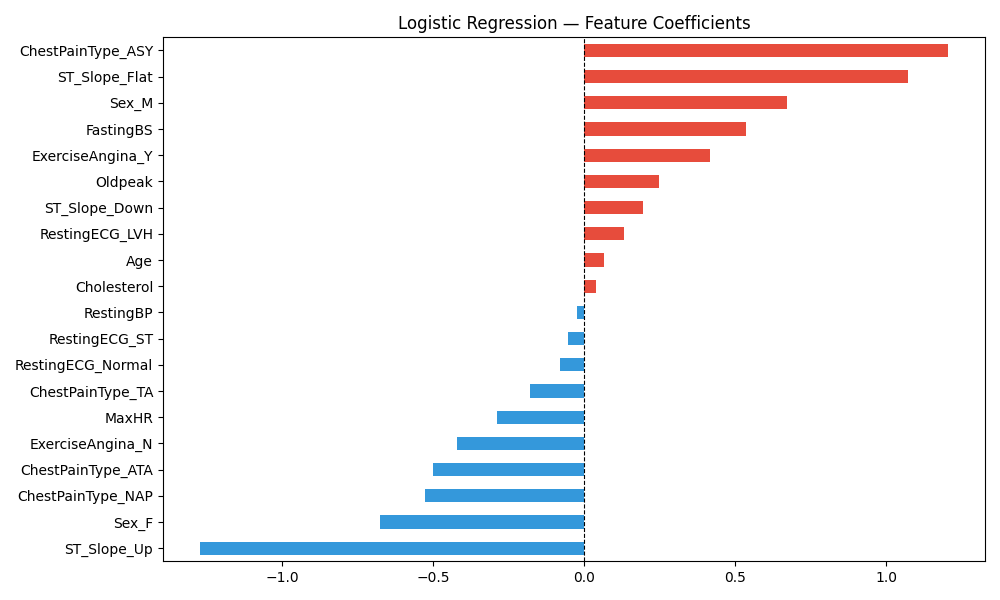

### Random Forest vs Gradient Boosting

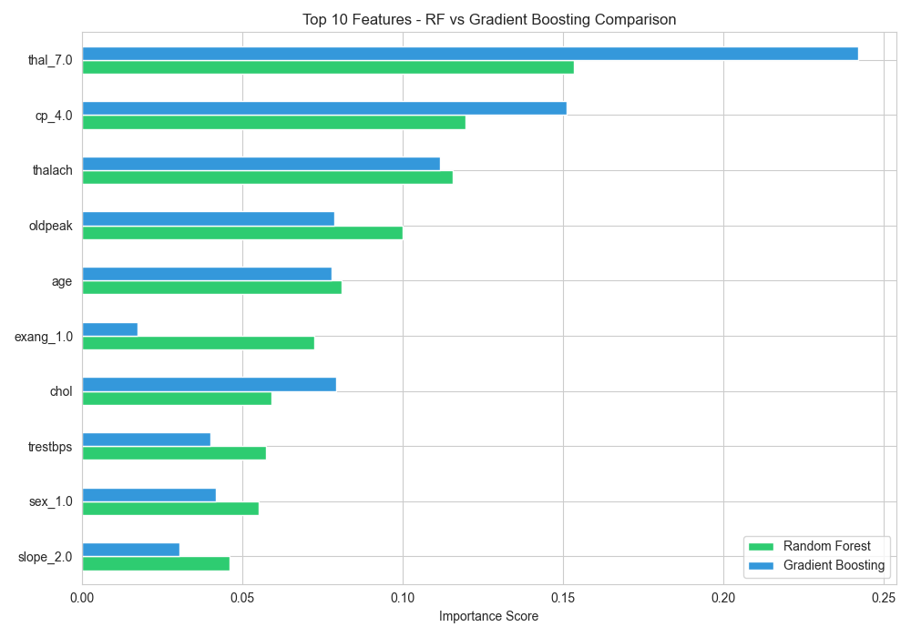

The analysis repeatedly highlights features such as:

- `ST_Slope`
- `ChestPainType`
- `MaxHR`
- `Oldpeak`
- `Age`
- `Cholesterol`
- `RestingBP`

Feature importance indicates contribution within a particular model; it does not establish medical causation.

---

# 9. Final Dashboard

The final dashboard summarizes the major model results and interpretation outputs in one place.

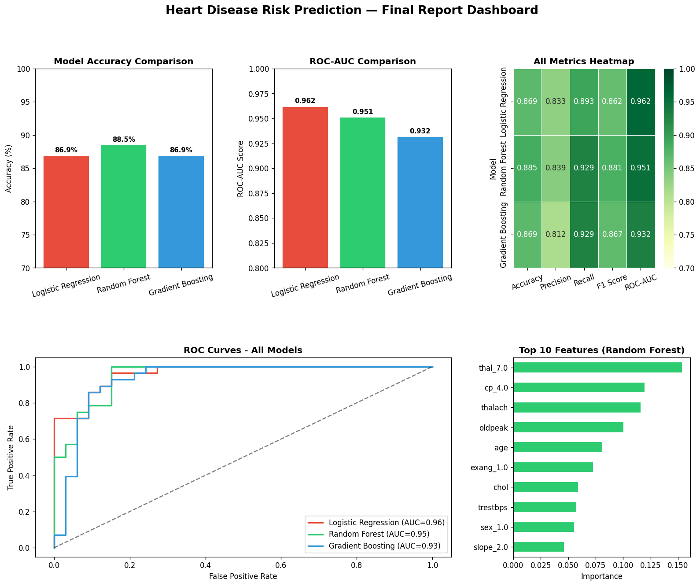

The dashboard contains:

- Model accuracy comparison
- ROC-AUC comparison
- Evaluation metrics heatmap
- ROC curves
- Top Random Forest features

---

# Project Structure

```text
Heart-Disease-Risk-Prediction/
│
├── data/
│   ├── heart.csv
│   ├── heart_cleaned.csv
│   ├── X_train.csv
│   ├── X_test.csv
│   ├── y_train.csv
│   └── y_test.csv
│
├── models/
│   ├── logistic_regression.pkl
│   ├── random_forest.pkl
│   ├── gradient_boosting.pkl
│   ├── extra_trees.pkl
│   ├── knn.pkl
│   ├── voting_ensemble.pkl
│   ├── scaler.pkl
│   └── results.csv
│
├── plots/
│   ├── 01_target_distribution.png
│   ├── 02_age_distribution.png
│   ├── 03_correlation_heatmap.png
│   ├── 04_boxplots.png
│   ├── 05_sex_vs_disease.png
│   ├── 06_lr_confusion_matrix.png
│   ├── 07_lr_roc_curve.png
│   ├── 08_rf_confusion_matrix.png
│   ├── 09_gb_confusion_matrix.png
│   ├── 10_roc_comparison.png
│   ├── 11_rf_feature_importance.png
│   ├── 12_gb_feature_importance.png
│   ├── 13_lr_coefficients.png
│   ├── 14_feature_comparison.png
│   └── 15_final_dashboard.png
│
├── step1_setup.py
├── step2_eda.py
├── step3_cleaning.py
├── step4_preprocessing.py
├── step5_logistic_regression.py
├── step6_advanced_models.py
├── step7_feature_importance.py
├── step8_final_report.py
│
├── requirements.txt
├── runtime.txt
└── README.md
```

---

# Installation

## Prerequisites

- Python 3.12
- Git
- pip

## 1. Clone the repository

```bash
git clone <your-repository-url>
cd Heart-Disease-Risk-Prediction
```

## 2. Create a virtual environment

### Windows

```bash
python -m venv venv
venv\Scripts\activate
```

### macOS / Linux

```bash
python3 -m venv venv
source venv/bin/activate
```

## 3. Install dependencies

```bash
pip install -r requirements.txt
```

---

# Running the Project

Execute the scripts in order:

```bash
python step1_setup.py
python step2_eda.py
python step3_cleaning.py
python step4_preprocessing.py
python step5_logistic_regression.py
python step6_advanced_models.py
python step7_feature_importance.py
python step8_final_report.py
```

Each stage generates the files required by the next stage.

---

# Technology Stack

### Programming Language

- Python 3.12

### Data Processing

- Pandas
- NumPy

### Visualization

- Matplotlib
- Seaborn

### Machine Learning

- Scikit-learn

### Model Persistence

- Pickle

### Application Framework

- Streamlit

### Development & Version Control

- VS Code
- Git
- GitHub

---

# Future Improvements

The current project can be extended into a more complete application by adding:

- Streamlit-based prediction interface
- Interactive patient input form
- Prediction probability display
- Model explainability using SHAP
- K-fold cross-validation
- Automated hyperparameter tuning
- Independent external validation
- Model calibration
- Prediction API
- Cloud deployment
- Automated testing and CI/CD

---

# Limitations

- The reported performance is based on the supplied dataset and test split.
- High test-set performance does not guarantee the same performance on unseen real-world populations.
- Feature importance should not be interpreted as medical causation.
- The models have not undergone clinical validation.
- External and prospective validation would be required for real-world medical use.

---

# Medical Disclaimer

This project is an **educational Machine Learning project**.

It should not be used to diagnose heart disease, recommend treatment, or make clinical decisions. Any real health concern should be evaluated by a qualified healthcare professional.

---

# Author

**Your Name**

B.Tech Student | Machine Learning | Data Science | Artificial Intelligence

### Skills Demonstrated

`Python` · `Pandas` · `NumPy` · `Scikit-learn` · `Machine Learning` · `EDA` · `Classification` · `Ensemble Learning` · `Feature Engineering` · `Data Visualization` · `Model Evaluation`

---

## ⭐ Project

If you find this project useful, consider giving the repository a star.

**Built with Python and Machine Learning.**
